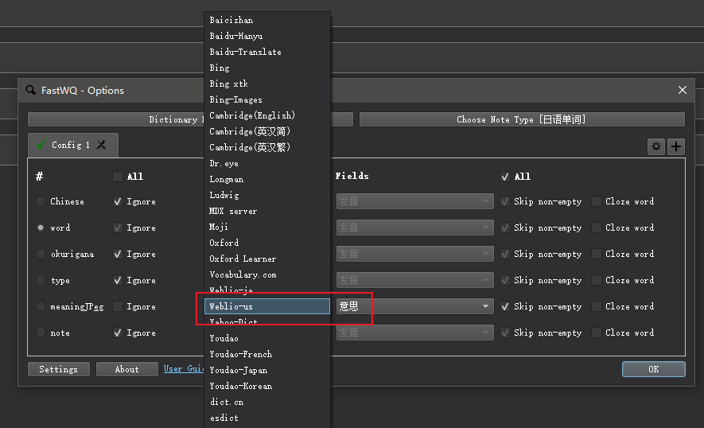
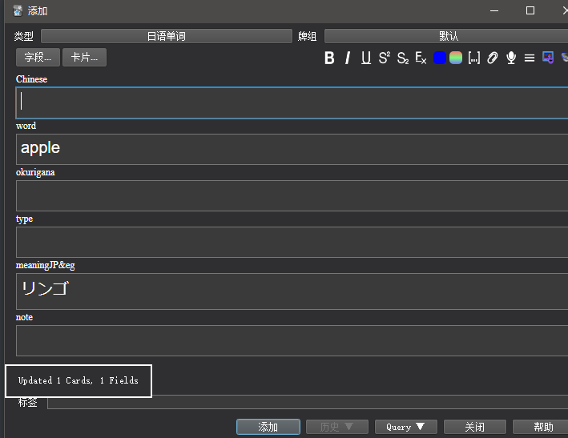
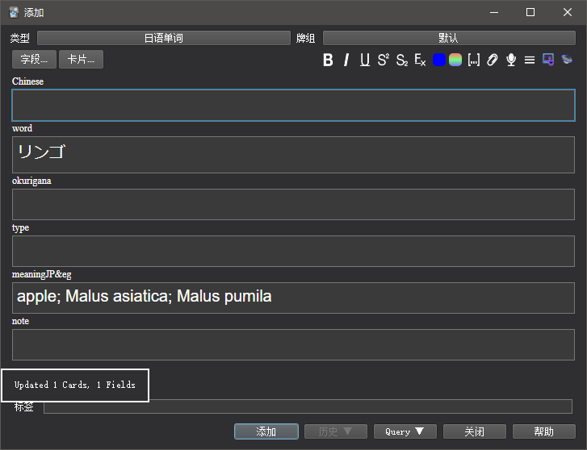

# 如何为Fast Word Query插件制作自己的网络词库

------

`Anki`添加单词有很多办法，可以导入他人的单词牌组，也可以自己去摘抄词典上的内容。当然，更高级一点的是通过浏览器插件遇到生词添加到`Anki`里。

那么有没有办法直接在`Anki`输入单词以后，可以将释义，发音等等内容自己添加进去呢？

答案就是：

​	有！通过**Fast Word Query 插件**

这是一张卡片：


**除了单词和释义是原来有的，其他内容都是通过Fast Word Query插件自己生成**

什么是Fast Word Query呢？麻烦请看一下这篇文章：

https://zhuanlan.zhihu.com/p/81645669

我在这里是讲Fast Word Query 高级用法，自己制作网络词库

------

## 条件

想要自己制作网络词库，是有一定条件的：

- python的基础

- 爬虫的知识

- 了解一点点网页结构（不美化界面，可以不太懂）


------

### 制作自己的词库其实不是特别难

如果你能获得你想捕获单词的网站API的话，可以很轻松的进行。

如果没有该网站的API的话，就要通过爬虫知识获得内容进行封装【一般封装为字典类型（dict）】

------

## 简易的过程

这里用伪代码的表示

`xx词库.py`:

```python
from ..base import *  #一定要有
import 引入自己需要的库
def 获取到单词的内容(word):
    ###对网站进行解析###
	###对内容封装为dict（字典）###
    return word_dict

@register([u'词库的名称', u'词库的名称-英文'])#接口名称
class 接口函数名称(WebService):#接口函数名称
    def __init__(self):
        super(接口函数名称, self).__init__()#接口函数名称
    def _get_from_api(self):
       	result=获取到单词的内容(self.word)#获取dict字典
        return self.cache_this(result)
    @export('单词释义')
    def 功能函数名称(self):
        ret=self._get_field('单词释义')#获取result[单词释义]内容
        return ret#返回单词释义
```

然后将该文件放入`%APPDATA%\Anki2\addons21\1807206748\service\dict`文件夹里

好了，我们制作自己的词库已经完成了！

文章结束。

------

相信你看到这里还是一头雾水。

别急，现在才正式开始讲如何制作。

------

## 制作过程

首先，由于我的能力不足，才刚刚学编程不到半年，可能出现专有名词的出错。

为**Fast Word Query 插件**添加自己词库，其实以前也有这种想法，网上却没有相关的文档的可以查看，只有在Github代码托管平台上源代码，没有帮助文档，就只能参考他自带的词库。所以一直没弄成功（我自己的原因），要么直接导致插件崩溃了，要么就是输出不了如何东西。直到8月14日才成功。

------

### 准备工作

首先，你需要有python

然后，你的python可能需要安装第三方库

在`cmd.exe`下敲下：

`pip install requests`

`pip install bs4`

有了这些以后，你就可以编写代码

------

### 提取信息及处理

这里，我以Weibo英日词典为例子。


我们这里可以知道：

原来查询单词的地址是`https://ejje.weblio.jp/content/{word}`

如果我们需要取`主な英訳/主な意味`的内容的话，可以需要先看网页的源代码


我们可以知道内容是在`content-explanation ej/content-explanation je`之下。

好了，如果我们现在就要编写代码的话，应该是这样的：

```python
import requests
from bs4 import BeautifulSoup as bs4
def WeblioSearch_English(word):
    result={
        'mean':u'', 
    }
    try:
        url=u'https://ejje.weblio.jp/content/{word}'.format(word=word)
        get_requests=requests.get(url,timeout=5)#设置超时
        soup=bs4(get_requests.content,'html.parser')
    except:
        return result
    result['mean']=soup.find('td',attrs={'class':['content-explanation je','content-explanation ej']}).text #主要意思
    result.update()#对result 字典更新
    return result

words =['apple','リンゴ']
for word in words:
    ret=WeblioSearch_English(word)
    print(ret)
```
输出结果：
```python
{'mean': 'リンゴ'}
{'mean': 'apple; Malus asiatica; Malus pumila'}
#这里type=dict
```

这里涉及爬虫和对网站的解析：

[BeautifulSoup全面总结]: https://zhuanlan.zhihu.com/p/35354532

------

### 接口

好了,我们有了数据以后,要怎么样对接那插件呢?

我们先来看看插件自带**百词斩词库的部分代码**

```python
#-*- coding:utf-8 -*-
import json
from ..base import *

@register([u'百词斩', u'Baicizhan'])
class Baicizhan(WebService):
    def __init__(self):
        super(Baicizhan, self).__init__()

    def _get_from_api(self):
        url = u"http://mall.baicizhan.com/ws/search?w={}".format(self.quote_word)
        result = {
            "accent": u"",
            "img": u"",
            "mean_cn": u"",
            "st": u"",
            "sttr": u"",
            "tv": u"",
            "word": u"",
            "df": u'',
        }
        try:
            html = self.get_response(url, timeout=5)#urllib2.urlopen(url, timeout=5).read()
            result.update(json.loads(html))
        except:
            pass
        return self.cache_this(result)
    ...
```

看了一下

我们会发现他引入了`from ..base import *` 这应该是其中一个关键。

接下来是

```python
@register([u'百词斩', u'Baicizhan'])
class Baicizhan(WebService):
    def __init__(self):
        super(Baicizhan, self).__init__()

    def _get_from_api(self):
        #...
        result = {
            "mean_cn": u"",
        }
        #...
        return self.cache_this(result)
    @export(u'中文释义')
    def fld_mean(self):
        return self._get_field('mean_cn')
```

``from ..base import *``:

​	引入大量内置库，同时也包含`WebService对象`可作为词库基类

​	所以我们的词库是从这里派生出来的。

`@register([u'百词斩', u'Baicizhan'])`:

​	词库的名称，一般是中文，英文。


​	注意：**这里不要跟已有的词库一样，可能出错**

```python
class Baicizhan(WebService):
    def __init__(self):
        super(Baicizhan, self).__init__()
```

词库接口，**需要注意的是**：

`super(Baicizhan, self).__init__()`中`super`的**第一个参数**需要是**词库对象的名称**

**词库的名称不能跟已有词库一样，否则会重复加载一样的**

```python
def _get_from_api(self):
    #...
    return self.cache_this(result)
```

这个`_get_from_api`函数名称和参数不要动，是词库的接口

在这个函数里面敲人我们的代码，然后通过`self.cache_this()`返回

`self.cache_this()`：

将我们输出的`dict`赋值给对象的`self.cache[self.word]`

```python
@export(u'中文释义')
def fld_mean(self):
    return self._get_field('mean_cn')
```


注册该词库的功能之一

`@export(u'中文释义')`:该功能的名称

`def fld_mean(self):` 函数名称

`self._get_field('mean_cn')`获取我们之前在`_get_from_api`的`result['mean_cn']`的内容。

​	注意**类型与原有保持一致**。是`string`就是`string`，是`list`就是`list`

------

### 对接

好了，这里就讲得差不多了，那么我们如何对接自己的词库呢？

我们需要引入`from ..base import *` 和`class`的内容写进去

`Weblio_English-Text.py`：

```python
import requests
from bs4 import BeautifulSoup as bs4
from ..base import * #对接

def WeblioSearch_English(word):
    result={
        'mean':u'', 
    }
    try:
        url=u'https://ejje.weblio.jp/content/{word}'.format(word=word)
        get_requests=requests.get(url,timeout=5)#设置超时
        soup=bs4(get_requests.content,'html.parser')
    except:
        return result
    result['mean']=soup.find('td',attrs={'class':['content-explanation je','content-explanation ej']}).text #主要意思
    result.update()
    return result
@register([u'Weblio-英日', u'Weblio-us'])#词库名称
class Weblio_English(WebService):#接口名称
    def __init__(self):
        super(Weblio_English, self).__init__()#接口名称保持一致
    def _get_from_api(self):
        result=WeblioSearch_English(self.word)#获取dict
        return self.cache_this(result)
    
    @export('意思')#功能名称
    def mean_(self):#功能函数
        return self._get_field('mean')
```

到这里，我们的词库已经写完了。

我们需要的是将自己的词库放到插件里面去。那么地址在哪里呢？

我们需要将该文件放入`%APPDATA%\Anki2\addons21\1807206748\service\dict`文件夹里

你也可以通过`find_dict.py`找到这个文件夹

`find_dict.py`:

```python
from aqt.winpaths import get_appdata
import os
ret=os.path.join(get_appdata(), "Anki2","addons21",'1807206748','service','dict')#获取Anki的Fast Words Query插件dict位置
print(ret)
```

------

### 展示







------

## 总结

通过给`Fast Words Query`添加词库，学到很多知识。

我以前有计划要学爬虫，但一直没有付出行动。

通过这次机会学习了`requests,BeautifulSoup`和一些网页结构知识。

### 经验总结

- 如果插件崩溃了，在`Anki`里找不到，**可能是你代码出现严重错误**
- 如果没有输出不了内容，**可能是`result`返回正常，但是在`@export(string)`下面的功能函数里面有写错的地方**
- 每一次测试都需要重开`Anki`

------

## 扩展

由于是扩展内容，就不做详细解释

### 导入媒体文件

可以找共同点

#### 音频

```python
@export('单词发音')
def word_audio(self):
    tts_url=self._get_field('tts')#取tts_url 地址
    audio_name = get_hex_name(self.unique.lower(), url, 'mp3')#文件名称
    if os.path.exists(audio_name) or self.download(tts_url, audio_name, 5):#判断是否存在 或者 是否写入成功
        with open(audio_name, 'rb') as f:
            if f.read().strip() == '{"error":"Document not found"}':
                res = ''
            else:
                res = self.get_anki_label(audio_name, 'audio') #返回符合Anki音频的代码
        if not res:
            os.remove(audio_name)
    return res
```

#### 图片

```python
@export('图片')
def word_img(self):
    url = self._get_field('img')#取img_url 地址
    if url and self.bcz_download_img:
        filename = url[url.rindex('/') + 1:]
        if os.path.exists(filename) or self.download(url, filename):
            return self.get_anki_label(filename, 'img')
    return ''
```

视频

```python
@export(u'单词tv')
def word_tv(self):
    video = self._get_field('tv')
    if video:
        return self.get_anki_label(video, 'video')
    return ''
```

### 使用CSS文件

`Moji-fast.py`:


```python
@with_styles(cssfile="_moji.css", need_wrap_css=False,wrap_class='mojidict-helper-card-container')
def _css(self, val):
    return val
@export('单词释义[简]')
def mean_simple(self):
    words=self._get_field('words')
    ret='''<div class="mojidict-helper-card"><div class="word-detail-container">'''
    for word in words:
        if word['spell']==self.word or word['pron']==self.word:
            word_Part_of_speech='['+''.join(re.findall(r'\[(.*?)\]',word['excerpt']))+']<br>'#词性
            word_val=re.sub(r"\[(.*?)\]", "",word['excerpt']).split()#分割
            word_text=''
            for text in word_val:
                word_text+=text+'<br>'
            word_text.rstrip('<br>')#去除末尾换行符
            word_text= word_Part_of_speech+word_text #词性+释义
            w='''<div class="word-detail"><span class="detail-title">{pron}</span>\
            <p>{excerpt}</p></div>'''.format(pron=word['pron'],excerpt=word_text)
            ret+=w
    ret=ret+'</div></div>'
    return self._css(ret)
```

------

## Github：

https://github.com/GDOU-LYF/WordSearch

提供

- 日语词库服务
- 文章涉及的代码